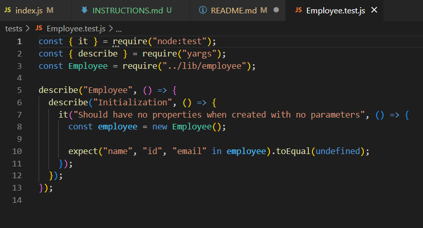
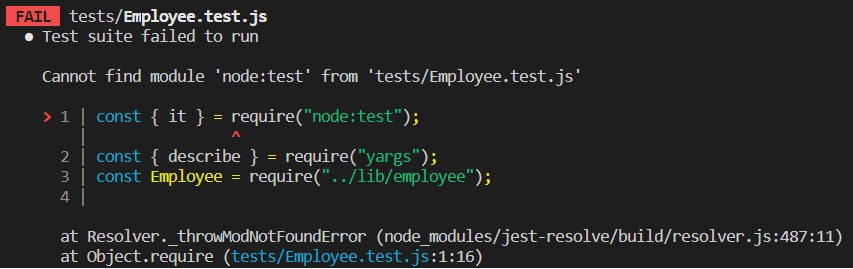

WALKTHROUGH VIDEO: https://drive.google.com/file/d/1JFa1nfMYbQpDY9u06d0oIReKXpnoKF_g/view

COMMAND LINE INTERFACE:
My CLI works to the extent that it can generate a file with one employee. I did not understand how to loop back to the checkbox menu where the user chooses Engineer, Intern, or Finished, and therefore the Finished option is not shown in my walkthrough video.

HTML GENERATION:
I use fs.appendFile to generate the initial HTML file. When/if I get the menu looping functionality to work, I will move this function into the .then ---> "Finished" function rather than the "Engineer" and "Intern" functions.

TESTING:
I built part of the test for the Employee class, but Jest throws an error when I enter "npm test" into the command line.

